# DOM Method  


### Penjelasan 

DOM Methods ialah sekumpulan Method/Function yang digunakan untuk melakukan manipulasi pada Element HTML ataupun pada Node yang ada pada dokumen HTML, sehingga dapat melakukan hal yang diinginkan.

Berikut beberapa method yang dapat digunakan untuk melakukan DOM

#### Method Manipulasi Element 

* .innerHTML
* .style 
* .setAttribute()
* .classList()

### 1. innerHTML 

Method *.innerHTML* ialah method yang dapat digunakan untuk memasukkan/mengganti sebuah teks atau element HTML di dalam halaman web. 

Contoh :
###### HTML
```html
<div class="percobaan">

</div>
```
Di atas kita ada sebuah element yaitu ```<div>``` yang tidak ada isinya dan di web tampak seperti gambar di bawah


Jika kita inspect source code, maka akan seperti gambar di bawah ini 

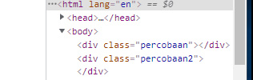

Sekarang saya akan menambahkan ```<a>``` yang berisi text, dengan menggunakan method/fungsi `innerHTML` caranya:

- Pertama kita seleksi div nya
###### Javascript
```js
const app = document.getElementsByClassName('percobaan')[0];
```
- Kedua kita masukkan tag dan tulisannya 
```js 
const app = document.getElementsByClassName('percobaan')[0];
app.innerHTML = '<a>Menggunakkan innerHTML</a>';
```
- Maka di browser hasilnya akan seperti di bawah ini


 Jika kita inspect source code, maka akan berubah seperti ini 

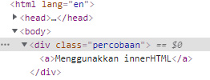

Jika pada elemen HTML yang diisi ada isinya maka isinya akan ditimpa seperti contoh berikut 

###### HTML 
```html 
  <div class="percobaan2">
        <a>ini akan diganti dengan innerHTML</a>
    </div>
```

Di atas kita ada ```<div>``` seperti pada contoh pertama tapi kali ini memiiki isi ```<a>```

- Jika dibuka di web hasilnya seperti gambar di bawah 

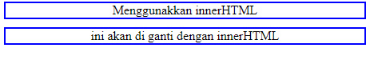

- Jika kita inspect, maka akan seperti gambar di bawah 

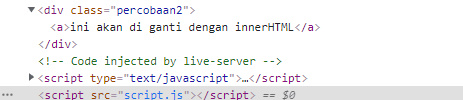

Di sini saya akan mengganti isi ```<div>``` yang merupakan ```<a>``` dengan ```<h1>``` berikut caranya :

- Pertama kita seleksi ```<div>``` nya
###### Javascript
```js
const app2 = document.getElementsByTagName('div')[1];
```
- Kedua kita masukkan ```<a>``` dan tulisannya 
```js 
const app2 = document.getElementsByTagName('div')[1];
app2.innerHTML = '<h1>Sudah di ganti</h1>';
```
- Maka di browser hasilnya akan seperti di bawah ini

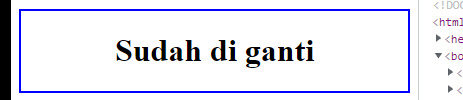

 Jika kita inspect source code, maka akan berubah seperti ini 

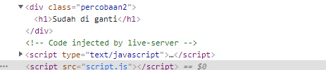

### 2. style

Method *.style* ialah method yang digunakan untuk memberikan style pada elemen HTML sebagaimana ketika menggunakan CSS, bedanya ini kita akan menggunakan javascript untuk memberikan stylenya, jika kita menggunakan metode ini untuk memberikan style pada suatu elemen, maka ini akan memberikan Inline CSS pada elemen tersebut .

Contoh 

Untuk contoh kali ini saya akan menggunakan kembali element HTML di materi sebelumnya, saya akan memberikan style pada ```<div>``` yang berada pada materi *.innerHTML* di atas, jadi kita langsung akan memberikan style dengan javascript dengan cara seperti ini 

- Pertama seleksi element yang akan diberi style dan di atas saya sudah melakukannya jadi saya tidak akan melakukannya lagi silahkan lihat gambar yang ada di bawah ini yang berasal dari materi *.innerHTML* di atas


- Kedua kita berikan aksinya, kita berikan style nya 

###### Javascript

```js
app.style.backgroundColor = 'blue';
app2.style.borderRadius = '10px' ;
```

Maka di browser hasilnya akan seperti gambar di bawah ini


dan juga ini 

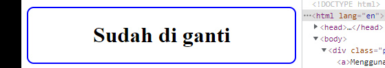

Jika kita inspect, hasilnya akan seperti ini 

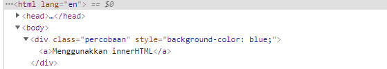

dan juga ini 


> Jadi intinya dengan method ini kita bisa memberikan style pada element HTML tanpa file CSS dan untuk melakukannya cukup mudah tapi itu akan terlihat kurang rapi jika nanti yang di berikan style itu banyak.
> Yang perlu diperhatikan di sini ialah ketika kita memberikan style nama propertinya itu ditulis dengan metode camelCase jika terdiri dari dua kata seperti contoh di atas bukan disambung dengan tanda ```-``` karena tanda itu akan dibaca sebagai pengurangan oleh javascript, jika satu kata ya dapat ditulis sebagaimana biasanya.

### 3. setAttribute()

Method *.setAttribute()* ialah method untuk memberikan attribute pada element HTML, selain itu kita juga dapat menghapus dan mengganti isi dari suatu attribute dengan menggunakan method *.removeAttribute()* untuk menghapus. Singkatnya method ini digunakan untuk mengelola attribute dari suatu element.

Contoh 
 
 HTML 
 ```html
     <div class="percobaan3">
        <input type="text" class ="input">
    </div>
 ```

 Jika dibuka di web hasilnya seperti gambar di bawah ini 

 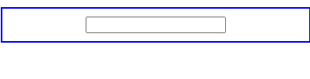

Jika kita inspect, akan seperti ini 

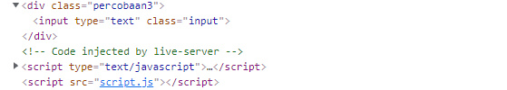


Di atas, ada sebuah ```<div>``` yang berisi ```<input>```, dalam contoh kali ini kita akan mengelola attribute pada kedua tag tersebut, caranya

- Pertama kita seleksi dulu element yang akan dimanipulasi

###### Javascript
```js
const app3 = document.getElementsByTagName("div")[2];
const input = document.getElementsByTagName("input")[0];
```
- Kedua kita manipulasi 
  * Pertama kita gunakan *.setAttribute* untuk memberikan atribut tambahan 

  ```js 
  input.setAttribute('name', 'input');
  ```

  Hasilnya seperti gambar di bawah ini jika di inspect

  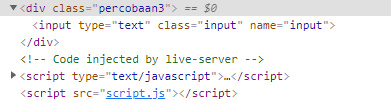

  * Kedua kita gunakan *.removeAttribute* untuk menghapus atribut class karena tidak akan digunakan lagi 
  ```js
  input.removeAttribute('class', "input");
  ```
  
Jika kita inspect, akan seperti gambar di bawah ini

  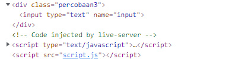


### 4. classList

Method *.classList* ialah method yang digunakan untuk mengelola class pada suatu elemen HTML.


> Ada beberapa method yang dapat digunakan mengelola class dengan method *.classList*

1. .classList.add() Untuk Menambah class

Contoh 

 Untuk contohnya saya akan menggunakan lagi element ```<div>``` yang ada pada materi *.setAttribute* jadi kita akan menambahkan class pada ```<div>``` yang ada pada materi *.setAttribute* tersebut
> jadi sekarang saya akan langsung untuk menambahkan class karena sebelumnya sudah saya seleksi pada materi *.setAttribute* diatas

Sebelumnya kita lihat dulu gambar sebelum ditambahkan 
 


dan jika kita inspect, maka akan seperti gambar di bawah ini


```js
app3.classList.add('gradient');
```
Jadi di atas saya sudah memberikan class gradient yang memiliki style css seperti di bawah ini
```css
 .gradient{
        background: linear-gradient(to bottom, blue , yellow , red );
        border-radius: 10px;
        border-color: transparent;
    }
```
Berikut hasil setelah class gradient ditambahkan


dan jika kita inspect, maka akan seperti gambar di bawah ini 

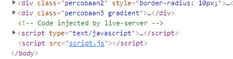

2. .classList.remove() Untuk Menghapus class

 Untuk contohnya saya juga akan menggunakan lagi element ```<div>``` yang ada pada materi *.setAttribute* jadi kita akan menambahkan class pada ```<div>``` yang ada pada materi *.setAttribute* 
 
> Jadi sekarang saya akan langsung untuk menghapus class karena sebelumnya sudah saya seleksi pada materi *.setAttribute* di atas kita akan menghapus class percobaan tiga pada ```<div>``` tersebut

Sebelum itu kita lihat dulu kodenya jika kita inspect sebelum hapus class percobaan.


```js
app3.classList.remove('percobaan3');
```

dan jika kita inspect, maka akan seperti gambar di bawah ini

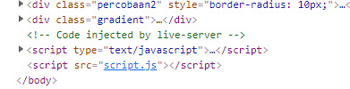


3. .classList.replace() Untuk Mengganti class

 Untuk contohnya saya akan menggunakan element ```<div>``` yang ada pada materi *.innerHTML* jadi kita akan mengganti class pada ```<div>``` yang ada pada materi *.innerHTML* tersebut dari class percobaan2 menjadi gradient

 Sebelumnya kita lihat dulu sebelum di ganti classnya 


dan jika kita inspect, maka akan seperti gambar di bawah ini


 ```js 
 app2.classList.replace('percobaan2', 'gradient');
 ```
Berikut hasilnya setelah class-nya dirubah 


dan jika kita inspect, maka akan seperti gambar di bawah ini

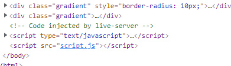
---

[](../003_Collections)

[](../005_Events)