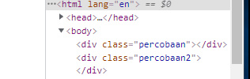
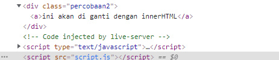
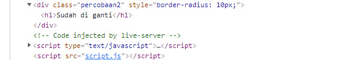

#                                                 DOM Method  
--------------------------------------------------------------------------------------------------------------------------

### Penjelasan 

DOM Methods Ialah sekumpulan Method/Function yang di gunakan untuk melakukan manipulasi pada dokumen atau halaman web sehingga dapat belakukan hal yang diinginkan 

Banyak Sekali Method atau Function Yang dapat di gunakan diantaranya :

* .innerHTML
* .style 
* .appendChild()
* .setAttribute()
* .classList()

### 1. innerHTML 

Method ini dapat di gunakan untuk memasukkan/Mengganti  sebuah Teks atau Element HTML didalam Halaman Web 

contoh :
###### HTML
```html
<div class="percobaan">

</div>
```
Diatas kita ada sebuah element yaitu ```<div>``` yang tidak ada isinya dan di Web tampak seperti gambar dibawah


jika di inspect source code seperti gambar di bawah ini 



Sekarang saya akan menambahkan ```<a>``` yang berisi text, dengan menggunakan method/fungsi innerHTML caranya:

- pertama kita seleksi div nya
###### Javascript
```js
const app = document.getElementsByClassName('percobaan')[0];
```
- kedua kita masukkan tag dan tulisannya 
```js 
const app = document.getElementsByClassName('percobaan')[0];
app.innerHTML = '<a>Menggunakkan innerHTML</a>';
```
- maka hasilnya akan seperti di bawah ini di browser


 jika di inspect source code berubah seperti ini 


jika pada elemen html yang di isi ada isinya maka isinya akan di timpa seperti contoh berikut 

###### HTML 
```html 
  <div class="percobaan2">
        <a>ini akan di ganti dengan innerHTML</a>
    </div>
```
di atas kita ada ```<div>``` seperti pada contoh pertama tapi kali ini memiiki isi ```<a>```

- jika di buka di web hasil  seperti gambar di bawah 


- jika di inspect seperti gambar di bawah 



Disini saya akan mengganti isinya ```<div>``` yang merupakan  ```<a>``` dengan ```<h1>``` berikut caranya :

- pertama kita seleksi div nya
###### Javascript
```js
const app2 = document.getElementsByTagName('div')[1];
```
- kedua kita masukkan tag dan tulisannya 
```js 
const app2 = document.getElementsByTagName('div')[1];
app2.innerHTML = '<h1>Sudah di ganti</h1>';
```
- maka hasilnya akan seperti di bawah ini di browser


 jika di inspect source code berubah seperti ini 


### .Style

Method Style ialah method yang di gunakan untuk memberikan style pada element HTML sebegaimna ketika menggunakan CSS bedanya ini kita aan menggunaan javascript untukk memberikan style nya, jika kita menggunakan Metodhe ini untuk memberikan style pada suatu element makan ini akan memberikan Inline CSS pada element tersebut 

contoh 

Untuk contoh kali ini saya akan menggunakan kembali element html di materi sebelumnya  saya  memberikan style pada ```<div>``` yang berada pada materi innerHTML yang di atas jadi kita langsung akan memberikan style dengan javascript caranya seperti ini 

- pertama seleksi element yang akan di beri style dan di atas saya sudah melakukannya jadi saya tidak  akan melakukannya lagi silahkan lihat gambar yang ada di bawah ini yang berasal dari materi innerHTML di atas


- kedua kita berikan aksinya kita berikan style nya 

javascript

```js
app.style.backgroundColor = 'blue';
app2.style.borderRadius = '10px' ;
```

maka hasilnya akan seperti gambar di bawah ini 


dan juga ini 


jika di inspect hasilnya akan seperti ini 


dan juga ini 




 
