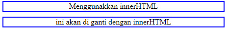
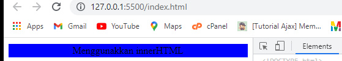
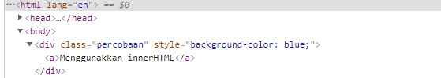
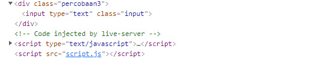
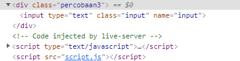
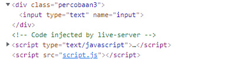

#                                                 DOM Method  
--------------------------------------------------------------------------------------------------------------------------

### Penjelasan 

DOM Methods Ialah sekumpulan Method/Function yang di gunakan untuk melakukan manipulasi pada Element HTML ataupun Pada Node yang ada pada dokument html tersebut sehingga dapat melakukan hal yang diinginkan 

Berikut beberapa Method yang dapat di gunakan  untukk melakukan DOM
#### Method Manipulasi  Element 
* .innerHTML
* .style 
* .setAttribute()
* .classList()

### 1. innerHTML 

Method *.innerHTML* ialah Method yang dapat di gunakan untuk memasukkan/Mengganti  sebuah Teks atau Element HTML didalam Halaman Web 

contoh :
###### HTML
```html
<div class="percobaan">

</div>
```
Diatas kita ada sebuah element yaitu ```<div>``` yang tidak ada isinya dan di Web tampak seperti gambar dibawah


jika di inspect source code seperti gambar di bawah ini 


Sekarang saya akan menambahkan ```<a>``` yang berisi text, dengan menggunakan method/fungsi innerHTML caranya:

- pertama kita seleksi div nya
###### Javascript
```js
const app = document.getElementsByClassName('percobaan')[0];
```
- kedua kita masukkan tag dan tulisannya 
```js 
const app = document.getElementsByClassName('percobaan')[0];
app.innerHTML = '<a>Menggunakkan innerHTML</a>';
```
- maka hasilnya akan seperti di bawah ini di browser


 jika di inspect source code berubah seperti ini 


jika pada elemen html yang di isi ada isinya maka isinya akan di timpa seperti contoh berikut 

###### HTML 
```html 
  <div class="percobaan2">
        <a>ini akan di ganti dengan innerHTML</a>
    </div>
```
di atas kita ada ```<div>``` seperti pada contoh pertama tapi kali ini memiiki isi ```<a>```

- jika di buka di web hasil  seperti gambar di bawah 



- jika di inspect seperti gambar di bawah 


Disini saya akan mengganti isinya ```<div>``` yang merupakan  ```<a>``` dengan ```<h1>``` berikut caranya :

- pertama kita seleksi ```<div>``` nya
###### Javascript
```js
const app2 = document.getElementsByTagName('div')[1];
```
- kedua kita masukkan ```<a>``` dan tulisannya 
```js 
const app2 = document.getElementsByTagName('div')[1];
app2.innerHTML = '<h1>Sudah di ganti</h1>';
```
- maka hasilnya akan seperti di bawah ini di browser


 jika di inspect source code berubah seperti ini 


### .style

Method *.style* ialah method yang di gunakan untuk memberikan style pada element HTML sebagaimana ketika menggunakan CSS bedanya ini kita akan menggunakan javascript untuk memberikan style nya, jika kita menggunakan Metodhe ini untuk memberikan style pada suatu element makan ini akan memberikan Inline CSS pada element tersebut 

contoh 

Untuk contoh kali ini saya akan menggunakan kembali element html di materi sebelumnya saya  akan memberikan style pada ```<div>``` yang berada pada materi *.innerHTML* yang di atas jadi kita langsung akan memberikan style dengan javascript caranya seperti ini 

- pertama seleksi element yang akan di beri style dan di atas saya sudah melakukannya jadi saya tidak  akan melakukannya lagi silahkan lihat gambar yang ada di bawah ini yang berasal dari materi *.innerHTML* di atas


- kedua kita berikan aksinya kita berikan style nya 

javascript

```js
app.style.backgroundColor = 'blue';
app2.style.borderRadius = '10px' ;
```

maka hasilnya akan seperti gambar di bawah ini  di browser



dan juga ini 


jika di inspect hasilnya akan seperti ini 



dan juga ini 


>> Jadi intinya dengan method ini kita bisa memberikan style pada element HTML tanpa Css dan untuk melakukannya cukup mudah tapi itu akan terlihat kurang rapi jika nanti yang di berikan itu banyak
>> yang perlu di perhatikan disini ialah ketika kita memberikan style nama propertinya itu di tulis dengan metode camelCase jika terdiri dari dua kata seperti dicontoh di atas bukkan disambung dengan tanda ```-``` karena tanda itu akan di baca sebagai pengurangan oleh javascript jika satu kata ya dapat di tulis sebagaimana biasanya.

### .setAttribute()

Method *.setAttribute()* ialah method untuk memberikan Attribute pada element HTML, Selain itu kita juga dapat menghapus dan mengganti isi dari suatu attribute dengan Menggunakan Method *.removeAttribute()* untukk menghapus. Singkatnya Method Method ini digunakan untuk mengelola attribute suatu Element

contoh 
 
 HTML 
 ```html
     <div class="percobaan3">
        <input type="text" class ="input">
    </div>
 ```
 jika di buka di web hasilnya seperti gambar di bawah ini 

 

jika di inspect akan seperti ini 




Di atas saya ada sebuah ```<div>``` yang berisi ```<input>``` dalam contoh kali ini ita akan mengelola Attribute pada kedua tag tersebut caranya

- Pertama kita seleksi dulu element yang akan di manipulasi

Javascript
```js
const app3 = document.getElementsByTagName("div")[2];
const input = document.getElementsByTagName("input")[0];
```
- kedua kita manipulasi 
  * pertama kita gunakan *.setAttribute* untuk memberikan Atribut tambahan 

  ```js 
  input.setAttribute('name', 'input');
  ```

  hasilnya seperti gambar di bawah ini jika di inspect
  

  * kedua kita gunakan *.removeAttribute* untuk menghapus atribut class karena tidak akan di gunakan lagi 
  ```js
  input.removeAttribute('class', "input");
  ```
    hasilnya seperti gambar di bawah ini jika di inspect
  


### .classList

Method *.classList* ialah metod yang di gunakan untuk mengelola class pada suatu element HTML


  


 
