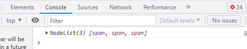
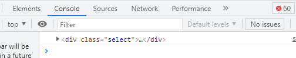
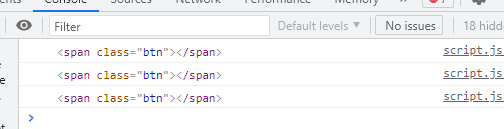
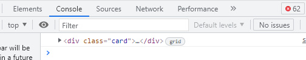
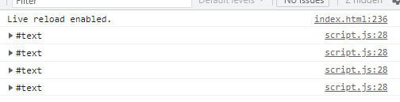
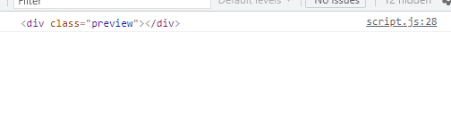
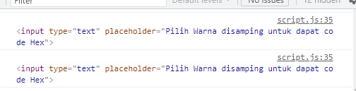
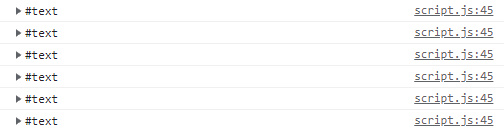
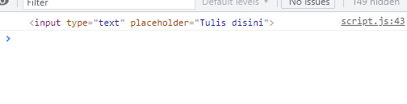

# DOM Traversal
DOM Traversal adalah metode DOM untuk memberikan sebuah aksi kepada sebuah Node atau Kumpulan Nodes dan sebuah _HTML Collection_ yang berada pada sebuah dokumen HTML.

Untuk melakukannya kita menjadikan satu buah object atau satu buah element/node untuk menjadi _trigger_ yang nanti akan menjadi patokan terjadinya suatu aksi pada sebuah Node/Element HTML Collection.

**Terdapat 6 metode yang dapat digunakan untuk melakukan penelusuran DOM**

|              Method            |   Hasil    |
| ------------------------------ | ---------- |
| .parentElement()               |   Element  |
| .parentNode()                  |   Node     |
| .nextSibling()                 |   Node     |
| .nextElementSibling()          |   Element  |
| .previousSibling()             |   Node     |
| .previousElementSibling()      |   Element  |

## Metode `.parentElement`
**Apa itu _parentElement_?**

_parentElement_ merupakan tag atau element yang membungkus suatu element atau tag HTML lainnya, Bisa di bilang orang tua dari element dari tag yang di bungkusnya, Seperti yang ada pada tabel di atas `.parentElement` menghasilkan element.

**Contoh**

Pada contoh ini kita akan memberikan aksi sederhana pada card dengan mengklik tombol

- HTML

```html
<div id="parentelement">
    <div class="select">
        <span class="btn"></span>
        <a a class="nama"> Larasati</a>
        <a class="umur">21</a>
        <a class="pekerjaan">Pedagang</a>
    </div>
</div>
```
Pada kode HTML diatas kita memiliki sebuah `<div>` yang membungkus `<div>` yg punya kelas select, yang dimana `<div>` select ini menyimpan 4 elemen di dalamnya yang terdiri dari 1 `<span>` dan 3 `<a>`

Untuk memberikannya aksi kita akan menggunakan metode parentElement sebelum itu kita perlu mencari span yang nantinya akan menjadi _trigger_ untuk terjadinya aksi, Berikut caranya:

- Javascript:

```js
// pertama cari span-nya(childElement) dan parentElement-nya
const parent = document.getElementById('parentelement');
const span = parent.querySelectorAll('span');
console.log(span); // cek jika span sudah tersimpan kedalam variable
```
Expected output:



Seperti terlihat diatas hasilnya adalah tipe NodeList, NodeList ini bersifat mirip seperti array karena memiliki index yang tentunya akan selalu dimulai dari 0.

**Memberi aksi:**

untuk memberikan aksi, _trigger_-nya harus bertipe element karena itu sebelum memberikan event kita akan melakukan pengulangan. Contohnya:
```js
const parent = document.getElementById('parentelement');
const span = parent.querySelectorAll('span');

span.forEach(function(el) {
    console.log(el); // cek jika span-nya berupa element
});
```
Expected output:


Setelah di cek hasilnya berupa element.

**Mencari parentElement:**

```js
const parent = document.getElementById('parentelement');
const span = parent.querySelectorAll('span');
span.forEach(function(el) {
    console.log(el);
    // Saat span di klik maka:
    el.addEventListener('click', function(e) {
        // cek parentElement dari element yang di klik
        console.log(e.target.parentElement)
    });
});
```
Expected output:



**Contoh penggunaan: Menambah class pada parent sebuah element**

```js
// Cari dan simpan parent elemen dan child elemennya
// kedalam variable masing-masing
const parent = document.getElementById('parentelement');
const span = parent.querySelectorAll('span');

// Loop dengan metode .forEach
span.forEach(function(el) {
    el.addEventListener('click', function(e) {
      // Saat elemen span di klik,
      // beri class "select" pada parent-nya
      e.target.parentElement.classList.add('select');
    });
});
```
 
**Reference:** [Klik disini](http://azqilana.github.io/Javascript/learn/DOM/007_Traversal/index.html#parentelement)

## Metode `.parentNode`
**Apa itu _parentNode_?**

_parentNode_ merupakan node yang membungkus kumpulan node atau tag HTML dan apapun yang berada dalam node tersebut, Seperti yang ada pada tabel di atas parentNode Menghasilan Node, Node dapat berbentuk apapun baik itu element HTML atau bukan.

**Contoh**
Pada contoh ini kita akan memberikan aksi sederhana pada card dengan mengklik tombol

- HTML
```html
<div id="parentnode">
    <div class="card">
        <span></span>
        <a class="nama">Muhammad Azqilana</a>
        <a class="umur">21 Tahun</a>
        <a class="pekerjaan">Mahasiswa</a>
    </div>
</div>
```
Pada kode HTML diatas kita memiliki sebuah `<div>` yang membungkus `<div>` yang mempunyai kelas select yang dimana `<div>` ini menyimpan 4 element di dalamnya yang terdiri dari 1 `<span>` dan 3 `<a>`.

Untuk memberikannya aksi kita akan menggunakan metode parentNode sebelum itu kita perlu mencari span yang nantinya akan menjadi _trigger_ untuk terjadinya aksi, Berikut caranya:

- Javascript

```js
// pertama cari span-nya(childElement) dan parentElement-nya
const parent = document.getElementById('parentnode');
const span = parent.querySelectorAll('span');
console.log(span); // cek jika span sudah tersimpan kedalam variable
 ```
Expected output:
 


Seperti yang terlihat di atas hasilnya bertipe NodeList, NodeList bersifat mirip seperti array karena memiliki index yang tentunya akan selalu dimulai dari 0.

**Memberi aksi:**

Untuk memberikan aksi, _trigger_-nya haruslah element karena itu sebelum memberikan event kita lakukan pengulangan.

```js
const parent = document.getElementById('parentnode');
const span = parent.querySelectorAll('span');
span.forEach(function (el) {
    console.log(el); // cek jika span-nya berupa elemen
});
```
Expected output:



Setelah di cek hasilnya berupa element.

**Mencari parentNode:**

```js
const parent = document.getElementById('parentnode');
const toggle = parent.querySelectorAll('span');
toggle.forEach(function (el) {
    console.log(el);
    // Saat span di klik maka:
    el.addEventListener('click', function(e) {
      // cek parentElement dari element yang di klik
        console.log(e.target.parentNode)
    });
});
```
Expected output:



**Contoh penggunaan: Menambahkan class pada parentNode element**

```js
// Cari dan simpan parent elemen dan child elemennya
// kedalam variable masing-masing
const parent = document.getElementById('parentnode');
const span = parent.querySelectorAll('span');

// Loop dengan metode .forEach
span.forEach(function (el) {
    console.log(el);
    el.addEventListener('click', function(e) {
      // Saat elemen span di klik,
      // beri class "btn" pada parentNode-nya
      e.target.parentNode.classList.add('btn');
    });
});
```

**Reference:** [Klik disini](http://azqilana.github.io/Javascript/learn/DOM/007_Traversal/index.html#parentnode)

## Metode `.nextSibling`
**Apa itu _nextSibling_?**

_nextSibling_ merupakan apapun yang berada setelah element atau tag tersebut bisa dibilang saudara atau adik dari element tersebut _nextSibling_ menghasilkan Node, maka bukan hanya menangkap element HTML tapi juga text dan apapun yang berada setelah tag atau element tersebut.

**Contoh**

Pada contoh kali ini kita akan membuat hal sederhana.

- HTML 
```html
<div id="nextsibling">
    <input type="text" placeholder="Tulis Nama Warna dalam bahasa inggris">
    <div class="preview"></div>
</div>
```
Diatas terdapat `<div>` yang membungkus 2 element yakni `<input>` dan `<div>` Dalam contoh kali ini kita akan melakukan DOM sederhana yakni mengubah warna background `<div>` yang di atas sesuai dengan value yang tertulis di `<input>`, Berikut caranya:

- Javascript

```js
// pertama simpan elementnya kedalam variable
// dalam hal ini yang akan kita tangkap element input seperti ini
const nSibling = document.getElementById("nextsibling");
const input = nSibling.getElementsByTagName("input")[0];
```
Kode di atas sebelum menyimpan inputnya kita tangkap dulu pembungkusnya untuk lebih mudah menangkap elementnya karena itu kita bisa menjadikan pembungkusnya sebagai patokan untuk mengambil element tersebut kita memberikan index [0] setelah menyimpan input sebelum `;` karena kita menangkap elementnya dengan `.getElementsByTagName()` yang hasilnya itu HTML Collections yang sifat atau berperilaku mirip seperti array dan memiliki index.

**Membuat aksi:**

```js
const nSibling = document.getElementById
("nextsibling");
const input = nSibling.getElementsByTagName("input")[0];

// Saat user meng-input sesuatu pada
// variable input ini maka:
input.addEventListener("input", function(e) {
  console.log(e.target.nextSibling) // cek nextSibling dari input ini
});
```
Expected output:



Dilihat dari hasil diatas bahwa `.nextSibling` input berupa text itu karena sesuai dengan tabel yang ada diatas bahwa `.nextSibling` menghasilkan Node yang dapat berupa apa saja untuk itu untuk menangkap `<div>`-nya caranya kita bisa mengakalinya dengan memberikan `.nextSibling` lagi setelah `.nextSibling`, Berikut contohnya:

**nextSibling to nextSibling**

```js
const nSibling = document.getElementById
("nextsibling");
const input = nSibling.getElementsByTagName("input")[0];
input.addEventListener("input", function(e) {
  console.log(e.target.nextSibling.nextSibling)
});
```
Expected output: 



nah sekarang `<div>` sudah di tangkap 

**Contoh penggunaan: Mengganti warna background**

```js
const nSibling = document.getElementById("nextsibling");
const input = nSibling.getElementsByTagName("input")[0];
input.addEventListener("input", function(e) {
  e.target.nextSibling.nextSibling.style.backgroundColor = `${e.target.value}`;
});
```
**Reference:** [Klik disini](http://azqilana.github.io/Javascript/learn/DOM/007_Traversal/index.html#nextsibling)

## Metode `.nextElementSibling`
**Apa itu _nextElementSibling_?**

_nextElementSibling_ merupakan element yang berada setelah tag atau element tersebut _nextElementSibling_ menangkap element dan tidak memperdulikan node yang berada setelah element tersebut.

**Contoh** 

Pada contoh kali ini kita akan memberikan aksi yang bisa di bilang berkebalikan dari aksi yang dilakukan pada contoh di materi `.nextSibling`, Berikut caranya:

- HTML
```html
<div id="nextelementsibling">
    <h3>Menggunakan metode nextElementSibling</h3>
    <input type="color">
    <input type="text" placeholder="Pilih Warna disamping untuk dapat code Hex">
</div>
```
Diatas kita terdapat `<div>` yang membungkus 2 element yakni 2 buah `<input>` yang satu bertipe color yang satu bertipe text, dalam contoh kali ini kita akan melakukan dom sederhana yakni kita akan mengubah isi dari `<input>` kedua sesuai dengan value/warna yang dipilih pada `<input>` pertama yg bertipe color nanti `<input>` kedua akan memunculkan _hex code_(`#`) dari warna di input type color, Berikut contohnya: 

- Javascript
```js
// Menyimpan element siblingnya dan input
// kedalam variable
const nElSibling = document.getElementById("nextelementsibling");
const isian = nElSibling.getElementsByTagName("input")[0];
```
Kode di atas sebelum menangkap inputnya kita simpan dulu pembungkusnya untuk lebih mudah menangkap elementnya, karena itu kita bisa menjadikan pembungkusnya sebagai patokan untuk mengambil element tersebut kita memberikan index 0, setelah menangkap input sebelum `;` karena kita menangkap elementnya dengan `.getElementsByTagName` yang hasilnya itu HTML Collection yang sifat atau berperilaku mirip seperti array dan memiliki index indexnya nol karena itu ialah tag input pertama, Selanjutnya:


**Memberi aksi:**
```js
const nElSibling = document.getElementById("nextelementsibling");
const isian = nElSibling.getElementsByTagName("input")[0];

// saat isian di input maka:
isian.addEventListener("input", function(e) {
  // cek nextElementSibling dari element yang terdapat pada isian
  console.log(e.target.nextElementSibling) 
});
```
Expected output: 



Dari hasil di atas sudah di dapat nextElementSiblingnya yakni input.

**Contoh penggunaan: Mengganti nilai**
```js
const nElSibling = document.getElementById("nextelementsibling");
const isian = nElSibling.getElementsByTagName("input")[0];

isian.addEventListener("input", function(e) {
  // mengganti value elementSibling dengan value isian
  e.target.nextElementSibling.value = e.target.value;
});
```
**Reference:** [Klik disini](http://azqilana.github.io/Javascript/learn/DOM/007_Traversal/index.html#nextelementsibling)

## Metode `.previousSibling`
**Apa itu _previousSibling_?**

_previousSibling_ maksudnya apapun yang berada sebelum element atau tag tersebut bisa dibilang saudara atau kakak dari element tersebut `.previousSibling` menghasilkan Node, maka bukan hanya menangkap element HTML tapi juga text dan apapun yang berada sebelum tag atau element tersebut.

**Contoh**

Pada contoh kali ini kita akan membuat contoh sederhana saja, Berikut caranya:

- HTML 
```html
 <div id="previouselementsibling">
        <h3>Menggunakan Method previousElementSibling</h3>
        <div class="kotak"></div>
        <input type="number" placeholder="Ketik Angka untuk memberikan rounded Pada kotak">
 </div>
```
 Diatas kita terdapat `<div>` yang membungkus 2 element yakni `<div>` dan `<input>`, dalam contoh kali ini kita akan melakukan DOM sederhana yakni kita akan memberikan rounded pada `<div>` yang di atas sesuai dengan value yang tertulis di `<input>`, Berikut contohnya:

- Javascript
```js
// pertama kita menyimpan elementnya
// dalam hal ini yang akan kita menyimpan element input seperti:
const preEleSibling = document.getElementById("previouselementsibling");
const rounded = preEleSibling.getElementsByTagName("input")[0];
```
Kode di atas sebelum menyimpan inputnya kita tangkap dulu pembungkusnya untuk lebih mudah menyimpan elementnya karena itu kita bisa menjadikan pembungkusnya sebagai patokan untuk mengambil element tersebut kita memberikan index 0, setelah menyimpan input sebelum `;` karena kita menyimpan elementnya dengan `.getElementsByTagName` yang hasilnya itu HTML Collection yang sifat atau berperilaku mirip seperti array dan memiliki index, indexnya satu karena itu merupakan tag input kedua dan seperti diketahui index array selalu mulai dari 0, Selanjutnya:

**Memberi aksi:**

```js
const preSibling = document.getElementById("previoussibling");
const inputText = preSibling.getElementsByTagName("input")[1];

// jika user menginput pada inputText maka:
inputText.addEventListener("input", function(e) {
  // cek previousSibling input apa
  console.log(e.target.previousSibling)
});
```
Expected output:



Dilihat dari hasil diatas bahwa `.previousSibling` input berupa text itu karena sesuai dengan tabel yang ada di atas bahwa `.previousSibling` menghasilkan Node yang dapat berupa apa saja, untuk itu untuk menangap inputnyanya caranya kita bisa mengakalinya dengan memberikan previousSibling lagi setelah previousSibling, Berikut caranya:

**previousSibling to previousSibling**

```js
const preSibling = document.getElementById("previoussibling");
const inputText = preSibling.getElementsByTagName("input")[1];
inputText.addEventListener("input", function(e) {
  // cek previousSibling dari previousSiblingnya 
  console.log(e.target.previousSibling.previousSibling)
});
```

Expected output: 



**Contoh penggunaan: Mengganti nilai**

```js
const preSibling = document.getElementById("previoussibling");
const inputText = preSibling.getElementsByTagName("input")[1];
inputText.addEventListener("input", function(e) {
  // ganti nilai dari previousSibling dari previousSiblingnya ke
  // nilai inputText
  e.target.previousSibling.previousSibling.value = e.target.value.length;
});
```
**Reference:** [Klik disini](http://azqilana.github.io/Javascript/learn/DOM/007_Traversal/index.html#previoussibling)

## Metode `.previousElementSibling`
**Apa itu _previousElementSibling_?**

previousElementSibling merupakan element yang berada setelah tag atau element tersebut previousElementSibling menangkap element dan tidak memperdulikan Node yang berada sebelum element tersebut

**Contoh** 

Dalam Contoh kali ini kita akan memberikan aksi yang dimana akan membuat rounded pada sebuah div kotak hanya dengan menambah angka inputan pada input.

```html
<div id="nextelementsibling">
    <h3>Menggunakan Method previousElementSibling</h3>
    <input type="color">
    <input type="text" placeholder="Pilih Warna disamping untuk dapat code Hex">
</div>
```

Diatas kita ada `<div>` yang membungkus 2 element yakni 2 buah `<input>` yang satu bertipe color yang satu bertipe text, dalam contoh kali ini kita akan melakukan dom sederhana yakni kita akan mengubah isi dari `<input>` kedua sesuai dengan value/warna yang dipilih pada `<input>` pertama yg bertipe color nanti `<input>` kedua akan memunculkan _hex code_ dari warna di input type color, Selanjutnya:

- Javascript

```js
// pertama kita menyimpan element-elementnya
// dalam hal ini yang akan kita menyimpan element input seperti:
const nElSibling = document.getElementById("nextelementsibling");
const isian = nElSibling.getElementsByTagName("input")[0];
```
Kode di atas sebelum menyimpan inputnya kita tangkap dulu pembungkusnya untuk lebih mudah menyimpan elementnya karena itu kita bisa menjadikan pembungkusnya sebagai patokan untuk mengambil element tersebut kita memberikan index 0, setelah menyimpan input sebelum `;` karena kita menyimpan elementnya dengan `.getElementsByTagName` yang hasilnya itu HTML Collection yang sifat atau berperilaku mirip seperti array dan memiliki index, indexnya nol karena itu merupakan tag input pertama dan satu-satunya, Selanjutnya:

**Memberi aksi:**
```js
const preEleSibling = document.getElementById("previouselementsibling");
const rounded = preEleSibling.getElementsByTagName("input")[0];

// jika user menginput pada rounded maka:
rounded.addEventListener("input", function(e) {
  // cek elemen apa yang terdapat sebelum rounded
  console.log(e.target.previousElementSibling)
});
```
Expected output:


Dari hasil diatas sudah di dapat `.previousElementSiblingnya` yakni input.

**Contoh penggunaan: Mengatur border radius**
```js
const preEleSibling = document.getElementById("previouselementsibling");
const rounded = preEleSibling.getElementsByTagName("input")[0];
rounded.addEventListener("input", function(e) {
  // tambahkan border radius pada elemen sebelum input dengan
  // nilai yang di input user pada rounded
  e.target.previousElementSibling.style.borderRadius = e.target.value + "%";
});
```
**Reference:** [Klik disini](http://azqilana.github.io/Javascript/learn/DOM/007_Traversal/index.html#previouselementsibling)

[](../006_Event_Listener)

[](../008_Event_Bubbling_and_Capturing)