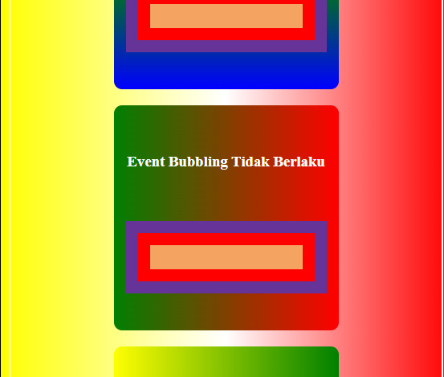

# **DOM Event Bubbling And Capturing**

Pada pembahasan kali ini saya akan membahas dua hal yang bisa dibilang bertentangan yang dilakukan oleh javascript pada code yang telah kita tulis, dua hal tersebut ialah :

## **1. Event Bubbling**

### **Penjelasan**

> _Event Bubbling_ ialah saat dimana event/aksi yang diberikan pada sebuah element juga memicu atau menjalankan event/aksi yang diberikan kepada element pembungkusnya (_parentElement_), jadi sesuai dengan namanya _Bubbling_ gelembung maka event/aksi nya akan menggelembung ke element pembungkusnya (_parentElement_).

### **Contoh**

- **Event Bubbling**

**HTML**

```html
<div class="bub">
  <h3>Event Bubbling</h3>
  <div class="bub1">
    <div class="bub2">
      <div class="bub3"></div>
    </div>
  </div>
</div>
```

Yang diberikan style

**CSS**

```css
div {
  padding: 15px;
}

h3 {
  margin-top: 5%;
  text-align: center;
  color: white;
}

.bub {
  display: flex;
  flex-direction: column;
  align-content: center;
  justify-content: space-around;
  position: relative;
  border-radius: 10px;
  margin: 10px auto;
  background: linear-gradient(to bottom, red, green, blue);
  height: 250px;
  width: 250px;
}

.bub1 {
  background-color: rebeccapurple;
  cursor: pointer;
}

.bub2 {
  background-color: red;
  cursor: pointer;
}

.bub3 {
  background-color: sandybrown;
  cursor: pointer;
}
```

Di atas saya ada sebuah `<div>` yang berisi `<div>` dan `<h3>` yang di dalam `<div>` ada `<div>` yang di dalamnya ada `<div>` juga, kali ini saya akan menunjukkan event bubbling yang terjadi pada element element di atas.

Berikut tampilan di browser

 

Jadi kita akan memberikan event ke setiap `<div>` mulai dari yang punya class bub1 sampai class bub3.

- Pertama, kita seleksi/tangkap setiap element, (dalam hai ini saya menyeleksinya berdasarkan class jadi harus diberi index)

  **Javascript**

```js
const bub = document.getElementsByClassName("bub")[0];
const bu1 = bub.getElementsByClassName("bub1")[0];
const bu2 = bu1.getElementsByClassName("bub2")[0];
const bu3 = bu2.getElementsByClassName("bub3")[0];
```

- Kedua, kita berikan aksi/event pada setiap `<div>`
  **Javascript**

```js
const bub = document.getElementsByClassName("bub")[0];
const bu1 = bub.getElementsByClassName("bub1")[0];
const bu2 = bu1.getElementsByClassName("bub2")[0];
const bu3 = bu2.getElementsByClassName("bub3")[0];
//Event Bubbling berlaku
bu1.addEventListener("click", function () {
  bu1.classList.toggle("abu");
  console.log("bu1");
});
bu2.addEventListener("click", function () {
  console.log("bu2");
  bu2.classList.toggle("hijau");
});
bu3.addEventListener("click", function () {
  console.log("bu3");
  bu3.classList.toggle("kuning");
});
```

Hasil ketika diberi aksi/event dapat di lihat pada gif di bawah ini :


Pada gif di atas dapat kita lihat pada console bahwa setelah menjalankan event pada variabel bu3 javascript juga menjalankan event pada element pembungkus (_parentElement_) dari bu3 dan begitu seterusnya sampai eventnya berhenti pada varibel bu1 dan itu dapat terlihat jelas dengan hasil console yang mencetak hasil console dari bu3 terlebih dahulu kemudian bu2 terus yang terakhir bu1 yang di mana bu1 ini variabel yang merupakan hasil inisialisasi dari element div yang memiliki class bub1 yang merupakan pembungkus dari `<div>` yang memiliki class bub2.

Tapi _Event Bubbling_ dapat menjadi masalah jika kita menginginkan eventnya berjalan saat element itu sendiri yang di klik, dan tidak ingin eventnya berjalan saat mengklik event yang ada di dalamnya. Untuk mengatasinya dapat memberikan _event.stopPropagation();_ yang berfungsi menjalankan event pada element yang di klik.

- **Event Bubbling Tidak Berlaku**
  Pada contoh kali ini saya akan memberikan contoh ketika event bubbling pada sebuah element.

Sesuai yang saya bilang sebelumnya event bubbling tidak berlaku jika diberikan _event.stopPropagation();_ pada element yang diberikan event.

Berikut Contohnya

```html
<div class="anbub">
  <h3>Event Bubbling Tidak Berlaku</h3>
  <div class="anbub1">
    <div class="anbub2">
      <div class="anbub3"></div>
    </div>
  </div>
</div>
```

Yang diberikan style

```css
.anbub {
  display: flex;
  flex-direction: column;
  align-content: center;
  justify-content: space-around;
  position: relative;
  border-radius: 10px;
  margin: 10px auto;
  background: linear-gradient(to left, red, green);
  height: 250px;
  width: 250px;
}

.anbub1 {
  background-color: rebeccapurple;
  cursor: pointer;
}

.anbub2 {
  background-color: red;
  cursor: pointer;
}

.anbub3 {
  background-color: sandybrown;
  cursor: pointer;
}
```

Berikut tampilan di browser

 

Jadi di atas saya ada element yang susunannya sama seperti element pada contoh pertama hanya berbeda nama class nya saja pada element di atas saya akan melakukan hal yang sama seperti pada contoh pertama

- Pertama, kita seleksi/tangkap setiap element (dalam hai ini saya menyeleksinya berdasarkan class jadi harus diberi index)

  **Javascript**

```js
const anbu = document.getElementsByClassName("anbub1")[0];
const anbu2 = document.getElementsByClassName("anbub2")[0];
const anbu3 = document.getElementsByClassName("anbub3")[0];
```

- Kedua, kita berikan aksi/event pada setiap `<div>`, tapi pada kali ini saya akan memberikan _event.stopPropagation();_ pada event nya
  **Javascript**

```js
const anbu = document.getElementsByClassName("anbub1")[0];
const anbu2 = document.getElementsByClassName("anbub2")[0];
const anbu3 = document.getElementsByClassName("anbub3")[0];

anbu.addEventListener("click", function (e) {
  console.log("anbu");
  e.target.classList.toggle("abu");
});
anbu2.addEventListener("click", function (e) {
  console.log("anbu2");
  e.target.classList.toggle("hijau");
  e.stopPropagation();
});
anbu3.addEventListener("click", (e) => {
  console.log("anbu3");
  e.target.classList.toggle("kuning");
  e.stopPropagation();
});
```

Hasil ketika diberi aksi/event dapat di lihat pada gif di bawah ini :


Pada gif di atas sudah kita lihat pada console bahwa setelah menjalankan event pada variabel anbu3 javascript tidak lagi menjalankan event pada element pembungkus (_parentElement_) dari anbu3 dan begitu seterusnya dapat terlihat jelas dengan hasil console yang mencetak hasil console dari anbu3 dan tidak kemudian memberi aksi/event pada anbu2 sampai anbu2 diberi aksi/event baru hasil console - nya di jalankan dan begitupun yang terjadi pada hasil console dari anbu yang di jalankan setelah diberi aksi/event.

## **2. Capturing**

### **Penjelasan**

> _Event Capturing_ ialah saat dimana event/aksi yang diberikan pada sebuah element juga menangkap dan menjalankan event/aksi yang diberikan kepada element pembungkusnya (_parentElement_), jadi sesuai dengan namanya _Capturing_ yang berarti menangkap, jadi ia menangkap event/aksi dari element pembungkusnya (_parentElement_).

### **Contoh**

Pada contoh kali ini saya akan memberikan contoh bagaimana cara kerja dari _Event Capturing_, langsung ke contohnya

```html
<div class="cap">
  <h3>Capturing</h3>
  <div class="cap1">
    <div class="cap2">
      <div class="cap3"></div>
    </div>
  </div>
</div>
```

Yang diberikan style

```css
.cap {
  display: flex;
  flex-direction: column;
  align-content: center;
  justify-content: space-around;
  position: relative;
  border-radius: 10px;
  margin: 10px auto;
  background: linear-gradient(to right, yellow, green);
  height: 250px;
  width: 250px;
}

.cap1 {
  background-color: rebeccapurple;
  cursor: pointer;
}

.cap2 {
  background-color: red;
  cursor: pointer;
}

.cap3 {
  background-color: sandybrown;
  cursor: pointer;
}
```

Berikut tampilan di browser

 

Jadi, di atas saya memiliki element yang strukturnya sama seperti element pada contoh pertama, hanya berbeda nama classnya saja, pada element di atas saya akan melakukan hal yang sama seperti pada contoh pertama

- Pertama, kita seleksi/tangkap setiap element (dalam hai ini saya menyeleksinya berdasarkan class jadi harus diberi index)

  **Javascript**

```js
const cap = document.getElementsByClassName("cap1")[0];
const cap2 = document.getElementsByClassName("cap2")[0];
const cap3 = document.getElementsByClassName("cap3")[0];
```

- Kedua, kita berikan aksi/event pada setiap `<div>` tapi pada kali ini saya akan memberikan nilai boolean `true` pada setiap eventnya. Nilai true ini memiliki arti bahwa event capturenya bernilai true atau berlaku pada event yang diberikan element tersebut

  **Javascript**

```js
const cap = document.getElementsByClassName("cap1")[0];
const cap2 = document.getElementsByClassName("cap2")[0];
const cap3 = document.getElementsByClassName("cap3")[0];

cap.addEventListener(
  "click",
  function () {
    console.log("cap");
  },
  true
);

cap2.addEventListener(
  "click",
  () => {
    console.log("cap2");
  },
  true
);

cap3.addEventListener(
  "click",
  function () {
    console.log("cap3");
  },
  true
);
```

Hasil ketika diberi aksi/event dapat di lihat pada gif di bawah ini :


Pada gif di atas dapat kita lihat pada console bahwa javascript menangkap dan menjalankan terlebih dahulu event dari pembungkus terluarnya baru setelah itu menjalankan event pada child nya.

[](../007_Traversal)
[](../009_Nodelist)
