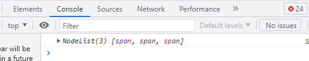
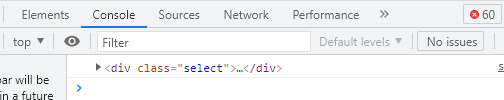
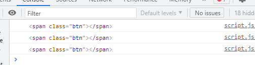
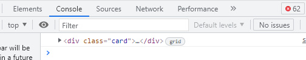

#DOM Traversal
-------------------------------------------------------------------------------------------------
>Dom Traversal Ialah cara untuk melakukan dom untuk memberikan  sebuah aksi kepada sebuah Node atau Kumpulan Nodes dan Sebuah HTMLColection atau Kumpulan HTML Colection yang berada pada sebuah document HTML.

>>Untuk Melakukannya Kita menjadikan satu buah objeck atau satu buah element/node untuk menjadi Triger yang nanti akan menjadi patokkan terjadinya suatu aksi pada sebuah   Node/Element HTML Colection

**Ada 6 Method yang dapat digunakkan untuk Melakukan  Penelusuran Dom**

|            Method           |   Hasil    |
| --------------------------- | ---------- |
| parentElement               |   Element  |
| parentNode                  |   Node     |
| nextSibling                 |   Node     |
| nextElementSibling          |   Element  |
| previousSibling             |   Node     |
| previousElementSibling      |   Element  |

###Penjelasan dan Contoh
1.Menggunakan parentElement

#####Penjelasan 
>parentElement ialah tag atau element yang membungkus element atau tag html lainnya atau bisa di bilang orang tua dari element dari tag yang di bungkusnya
>>Seperti yang ada pada tabel di atas parentElement Menghasilan Element atau element tag html yang langsung dapat diberikan aksi dan element selalu berbentuk element tag html

#####Contoh
untuk contoh ini saya hanya akan memberikan aksi sederhana pada card dengan mengklik tombol

kode HTML
```html

<div id="parentelement">
    <div class="select">
        <span class="btn"></span>
        <a a class="nama"> Larasati</a>
        <a class="umur">21</a>
        <a class="pekerjaan">Pedagang</a>
    </div>
</div>
```
>Pada kode html diatas kita ada sebuah ```<div>``` yang membungkus```<div>``` yg punya kelas select
yang dimana ```<div>``` ini memyimpan 4 elemen di dalamnya yang terdiri dari 1 ```<span>```  dan 3  ```<a>```

untuk memberikannya aksi kita akan menggunakan method parentElement sebelum itu kita perlu menangkap span yang nantinya akan menjadi triger untuk terjadinya aksi
berikut kode javascriptnya

 - pertama kita tangkap dulu spannya
```js
const pElement = document.getElementById('parentelement');
const toggleDua = pElement.querySelectorAll('span');
```
 - kedua kita cek apakah span nya terseleksi atau tidak

 ```js
const pElement = document.getElementById('parentelement');
const toggleDua = pElement.querySelectorAll('span');
console.log(toggleDua);
 ```
 hasilnya 
  

  sepeti terlihat di atas hasilnya nodelist dan nodelist bersifat seperti array dan memiliki indeks yang tentunya dimulai dari 0 sedangkan untuk memberikan aksi, trigernya haruslah element karena itu sebelum memberikan event kita lakukan pengulangan dan kita cek apakah span nya sudah berbentuk element
  seperti dibawah ini 

```js
const pElement = document.getElementById('parentelement');
const toggleDua = pElement.querySelectorAll('span');
toggleDua.forEach(function (td) {
        console.log(td);
});
```


setelah di cek sekarang hasilnya spannya sudah berbentuk element
setelah itu maka kita cek siapa parentElement dari span 
```js
const pElement = document.getElementById('parentelement');
const toggleDua = pElement.querySelectorAll('span');
toggleDua.forEach(function (td) {
    console.log(td);
    td.addEventListener('click', function (e) {
        console.log(e.target.parentElement)
    });

});
```


setelah itu baru kita berikan aksi 

```js
const pElement = document.getElementById('parentelement');
const toggleDua = pElement.querySelectorAll('span');
toggleDua.forEach(function (td) {
    console.log(td);
    td.addEventListener('click', function (e) {
        e.target.parentElement.classList.toggle('select');
        e.target.parentElement.classList.toggle('card');
        e.target.classList.toggle('btn');
    });

});
```
kode diatas masudnya jika span di klik ia akan mengecek parentElement span ada class select tidak ada class card tidak  jika ada hapus classnya jika nggak ada kasih classnya 
untuk lihat demo klik bawah
<a href="http://azqilana.github.io/Javascript/learn/DOM/008_Traversal/index.html/#parentelement" target="_blank" rel="noopener noreferrer"><button style="bacground-color:blue;border-radius:10px;">Demo</button></a>
2.Menggunakan parentNode

##### Penjelasan
>parentNode ialah node yang membungkus kumpulan node atau tag html dan apapun yang berada dalam node tersebut  
>Seperti yang ada pada tabel di atas parentNode Menghasilan Node dan Node dapat berbentu apapun baik itu elemnt html atau bukan

##### Contoh
untuk contoh ini saya hanya akan memberikan aksi sederhana pada card dengan mengklik tombol

kode HTML
```html
<div id="parentnode">
    <div class="card">
        <span></span>
        <a class="nama">Muhammad Azqilana</a>
        <a class="umur">21 Tahun</a>
        <a class="pekerjaan">Mahasiswa</a>
    </div>
</div>
```
>Pada kode html diatas kita ada sebuah ```<div>``` yang membungkus```<div>``` yg punya kelas select
yang dimana ```<div>``` ini memyimpan 4 elemen di dalamnya yang terdiri dari 1 ```<span>```  dan 3  ```<a>```

untuk memberikannya aksi kita akan menggunakan method parentNode sebelum itu kita perlu menangkap span yang nantinya akan menjadi triger untuk terjadinya aksi
berikut kode javascriptnya

 - pertama kita tangkap dulu spannya
```js
const pNode = document.getElementById('parentnode');
const toggle = pNode.querySelectorAll('span');
```
 - kedua kita cek apakah span nya terseleksi atau tidak

 ```js
const pNode = document.getElementById('parentnode');
const toggle = pNode.querySelectorAll('span');
console.log(toggle);
 ```
 hasilnya 
  

  sepeti terlihat di atas hasilnya nodelist dan nodelist bersifat seperti array dan memiliki indeks yang tentunya dimulai dari 0 sedangkan untuk memberikan aksi, trigernya haruslah element karena itu sebelum memberikan event kita lakukan pengulangan dan kita cek apakah span nya sudah berbentuk element
  seperti dibawah ini 

```js
const pNode = document.getElementById('parentnode');
const toggle = pNode.querySelectorAll('span');
toggle.forEach(function (t1) {
        console.log(t1);
});
```


setelah di cek sekarang hasilnya spannya sudah berbentuk element
setelah itu maka kita cek siapa parentNode dari span 
```js
const pNode = document.getElementById('parentnode');
const toggle = pNode.querySelectorAll('span');
toggle.forEach(function (t1) {
    console.log(t1);
    t1.addEventListener('click', function (e) {
        console.log(e.target.parentNode)
    });

});
```


setelah itu baru kita berikan aksi 

```js
const pNode = document.getElementById('parentnode');
const toggle = pNode.querySelectorAll('span');
toggle.forEach(function (t1) {
    console.log(t1);
    t1.addEventListener('click', function (e) {
        e.target.parentNode.classList.toggle('select');
        e.target.parentNode.classList.toggle('card');
        e.target.classList.toggle('btn');
    });

});
```
kode diatas masudnya jika span di klik ia akan mengecek parentNode span ada class select tidak ada class card tidak  jika ada hapus classnya jika nggak ada kasih classnya 
untuk lihat demo klik bawah
<a href="http://azqilana.github.io/Javascript/learn/DOM/008_Traversal/index.html/#parentnode" target="_blank" rel="noopener noreferrer"><button style="bacground-color:blue;border-radius:10px;">Demo</button></a>

3.Menggunakan nextSibling
##### Penjelasan
>nextSibling masudnya ialah apapun yang berada setelah element atau tag tersebut bisa dibilang saudara atau adi dr element tsb nextSibling menghasilkan node jd buan hanya menangkap elemen html tp juga text dan apapun yang berada setelah tag atau element tersebut.


