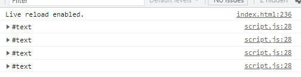
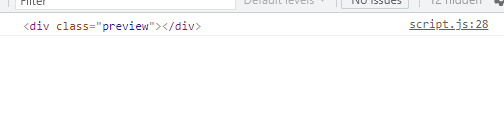
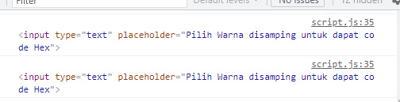
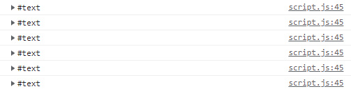
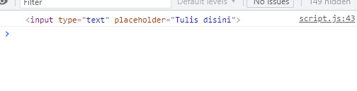

# DOM Traversal
-------------------------------------------------------------------------------------------------
> Dom Traversal Ialah cara untuk melakukan dom untuk memberikan  sebuah aksi kepada sebuah Node atau Kumpulan Nodes dan Sebuah HTMLColection atau Kumpulan HTML Colection yang berada pada sebuah document HTML.

>> Untuk Melakukannya Kita menjadikan satu buah objeck atau satu buah element/node untuk menjadi Triger yang nanti akan menjadi patokkan terjadinya suatu aksi pada sebuah   Node/Element HTML Colection

**Ada 6 Method yang dapat digunakkan untuk Melakukan  Penelusuran Dom**

|            Method           |   Hasil    |
| --------------------------- | ---------- |
| parentElement               |   Element  |
| parentNode                  |   Node     |
| nextSibling                 |   Node     |
| nextElementSibling          |   Element  |
| previousSibling             |   Node     |
| previousElementSibling      |   Element  |

### Penjelasan dan Contoh
1.Menggunakan parentElement

##### Penjelasan 
> parentElement ialah tag atau element yang membungkus element atau tag html lainnya atau bisa di bilang orang tua dari element dari tag yang di bungkusnya
>> Seperti yang ada pada tabel di atas parentElement Menghasilan Element atau element tag html yang langsung dapat diberikan aksi dan element selalu berbentuk element tag html

##### Contoh
untuk contoh ini saya hanya akan memberikan aksi sederhana pada card dengan mengklik tombol

kode HTML
```html

<div id="parentelement">
    <div class="select">
        <span class="btn"></span>
        <a a class="nama"> Larasati</a>
        <a class="umur">21</a>
        <a class="pekerjaan">Pedagang</a>
    </div>
</div>
```
> Pada kode html diatas kita ada sebuah ```<div>``` yang membungkus```<div>``` yg punya kelas select
yang dimana ```<div>``` ini memyimpan 4 elemen di dalamnya yang terdiri dari 1 ```<span>```  dan 3  ```<a>```

untuk memberikannya aksi kita akan menggunakan method parentElement sebelum itu kita perlu menangkap span yang nantinya akan menjadi triger untuk terjadinya aksi
berikut kode javascriptnya

 - pertama kita tangkap dulu spannya
```js
const pElement = document.getElementById('parentelement');
const toggleDua = pElement.querySelectorAll('span');
```
 - kedua kita cek apakah span nya terseleksi atau tidak

 ```js
const pElement = document.getElementById('parentelement');
const toggleDua = pElement.querySelectorAll('span');
console.log(toggleDua);
 ```
 hasilnya 
  

  sepeti terlihat di atas hasilnya nodelist dan nodelist bersifat seperti array dan memiliki indeks yang tentunya dimulai dari 0 sedangkan untuk memberikan aksi, trigernya haruslah element karena itu sebelum memberikan event kita lakukan pengulangan dan kita cek apakah span nya sudah berbentuk element
  seperti dibawah ini 

```js
const pElement = document.getElementById('parentelement');
const toggleDua = pElement.querySelectorAll('span');
toggleDua.forEach(function (td) {
        console.log(td);
});
```


setelah di cek sekarang hasilnya spannya sudah berbentuk element
setelah itu maka kita cek siapa parentElement dari span 
```js
const pElement = document.getElementById('parentelement');
const toggleDua = pElement.querySelectorAll('span');
toggleDua.forEach(function (td) {
    console.log(td);
    td.addEventListener('click', function (e) {
        console.log(e.target.parentElement)
    });

});
```


setelah itu baru kita berikan aksi 

```js
const pElement = document.getElementById('parentelement');
const toggleDua = pElement.querySelectorAll('span');
toggleDua.forEach(function (td) {
    console.log(td);
    td.addEventListener('click', function (e) {
        e.target.parentElement.classList.toggle('select');
        e.target.parentElement.classList.toggle('card');
        e.target.classList.toggle('btn');
    });

});
```
kode diatas maksudnya jika span di klik ia akan mengecek parentElement span ada class select tidak, ada class card tidak,  jika ada hapus classnya jika nggak ada kasih classnya 
Demo klik bawah

<a href="http://azqilana.github.io/Javascript/learn/DOM/008_Traversal/index.html#parentelement" target="_blank" rel="noopener noreferrer"><button style="background-color:blue;border-radius:10px;">Demo</button></a>


2.Menggunakan parentNode

##### Penjelasan
>parentNode ialah node yang membungkus kumpulan node atau tag html dan apapun yang berada dalam node tersebut  
>Seperti yang ada pada tabel di atas parentNode Menghasilan Node dan Node dapat berbentu apapun baik itu elemnt html atau bukan

##### Contoh
untuk contoh ini saya hanya akan memberikan aksi sederhana pada card dengan mengklik tombol

kode HTML
```html
<div id="parentnode">
    <div class="card">
        <span></span>
        <a class="nama">Muhammad Azqilana</a>
        <a class="umur">21 Tahun</a>
        <a class="pekerjaan">Mahasiswa</a>
    </div>
</div>
```
> Pada kode html diatas kita ada sebuah ```<div>``` yang membungkus```<div>``` yg punya kelas select
yang dimana ```<div>``` ini memyimpan 4 elemen di dalamnya yang terdiri dari 1 ```<span>```  dan 3  ```<a>```

untuk memberikannya aksi kita akan menggunakan method parentNode sebelum itu kita perlu menangkap span yang nantinya akan menjadi triger untuk terjadinya aksi
berikut kode javascriptnya

 - pertama kita tangkap dulu spannya
```js
const pNode = document.getElementById('parentnode');
const toggle = pNode.querySelectorAll('span');
```
 - kedua kita cek apakah span nya terseleksi atau tidak

 ```js
const pNode = document.getElementById('parentnode');
const toggle = pNode.querySelectorAll('span');
console.log(toggle);
 ```
 hasilnya 
 
  

  sepeti terlihat di atas hasilnya nodelist dan nodelist bersifat seperti array dan memiliki indeks yang tentunya dimulai dari 0 sedangkan untuk memberikan aksi, trigernya haruslah element karena itu sebelum memberikan event kita lakukan pengulangan dan kita cek apakah span nya sudah berbentuk element
  seperti dibawah ini 

```js
const pNode = document.getElementById('parentnode');
const toggle = pNode.querySelectorAll('span');
toggle.forEach(function (t1) {
        console.log(t1);
});
```


setelah di cek sekarang hasilnya spannya sudah berbentuk element
setelah itu maka kita cek siapa parentNode dari span 
```js
const pNode = document.getElementById('parentnode');
const toggle = pNode.querySelectorAll('span');
toggle.forEach(function (t1) {
    console.log(t1);
    t1.addEventListener('click', function (e) {
        console.log(e.target.parentNode)
    });

});
```


setelah itu baru kita berikan aksi 

```js
const pNode = document.getElementById('parentnode');
const toggle = pNode.querySelectorAll('span');
toggle.forEach(function (t1) {
    console.log(t1);
    t1.addEventListener('click', function (e) {
        e.target.parentNode.classList.toggle('select');
        e.target.parentNode.classList.toggle('card');
        e.target.classList.toggle('btn');
    });

});
```
kode diatas maksudnya jika span di klik ia akan mengecek parentNode span ada class select tidak, ada class card tidak, jika ada hapus classnya, jika nggak ada kasih classnya.
Demo klik bawah

<a href="http://azqilana.github.io/Javascript/learn/DOM/008_Traversal/index.html#parentnode" target="_blank" rel="noopener noreferrer"><button style="background-color:blue;border-radius:10px;">Demo</button></a>

3.Menggunakan nextSibling

##### Penjelasan

>>nextSibling maksudnya ialah apapun yang berada setelah element atau tag tersebut bisa dibilang saudara atau adik dr element tsb nextSibling menghasilkan node jd bukan hanya menangkap element html tp juga text dan apapun yang berada setelah tag atau element tersebut.

##### Contoh

Dalam Contoh kali ini saya akan membuat contoh sederhana saja

HTML 
```html
<div id="nextsibling">
    <input type="text" placeholder="Tulis Nama Warna dalam bahasa inggris">
    <div class="preview"></div>
</div>
```
 >Diatas kita ada ```<div>``` yang membungkus 2 element yakni ``` <input> ``` dan ```<div>```
 >>Dalam contoh kali ini saya akan melakukan dom sederhana yakni saya akan mengubah warna background ```<div>``` yang di atas sesuai dengan value yang tertulis di ``` <input> ```

caranya seperti ini 
- pertama kita tangkap elementnya dalam hal ini yang akan kita tangkap element input seperti ini
```js
const nSibling = document.getElementById("nextsibling");
const input = nSibling.getElementsByTagName("input")[0];
```
> Code di atas sebelum menangkap inputnya saya tangkap dulu pembungkusnya untuk lebih mudah menangkap elementnya karena itu saya bisa menjadikan pembungkusnya sebagai patokan untuk mengambil element tersebut saya memberikan index [0] setelah menangkap input sebelum ';' karena saya menangkap elementnya dengan getElementsByTagName yang hasilnya itu HTML Colection yang sifat atau berperilaku seperti array dan memiliki index indexnya nol karena itu ialah tag input pertama dan satu satunya.
- kedua cek nextSibling input siapa
```js
const nSibling = document.getElementById
("nextsibling");
const input = nSibling.getElementsByTagName("input")[0];
input.addEventListener("input", function (e) {
  console.log(e.target.nextSibling)
});
```
hasilnya



dilihat dari hasil di atas bahwa nextSibling input berupa textitu karena sesuai dengan tabel yang ada di atas bahwa nextSibling menghasilkan Node yang dpt berupa apa saja
  untuk itu untuk menangap divnya caranya kita
  bisa mengakalinya dengan memberikan nextSibling lagi setelah nextSibling

```js
const nSibling = document.getElementById
("nextsibling");
const input = nSibling.getElementsByTagName("input")[0];
input.addEventListener("input", function (e) {
  console.log(e.target.nextSibling.nextSibling)
});
```

hasilnya 



>nah sekarang ```<div>``` sudah di tangkap 
 - terahir kita berikan aksi

```js
const nSibling = document.getElementById("nextsibling");
const input = nSibling.getElementsByTagName("input")[0];
input.addEventListener("input", function (e) {
  e.target.nextSibling.nextSibling.style.backgroundColor = "" + e.target.value;
});
```
Demo klik di bawah

<a href="http://azqilana.github.io/Javascript/learn/DOM/008_Traversal/index.html#nextsibling" target="_blank" rel="noopener noreferrer"><button style="background-color:blue;border-radius:10px;">Demo</button></a>

4.Menggunakan nextElementSibling

##### Penjelasan
>nextElementSibling ialah element yang berada setelah tag atau element tersebut nextElementSibling menangkap element dan tidak memperdulikan node yang berada setelah element tersebut

##### Contoh 

Dalam Contoh kali ini  saya akan memberikan aksi yang bisa di bilang kebalikan dari aksi yang dilakukan pada contoh di materi nextSibling langsung saja

```html
    <div id="nextelementsibling">
        <h3>Menggunakan Method nextElementSibling</h3>
        <input type="color">
        <input type="text" placeholder="Pilih Warna disamping untuk dapat code Hex">
    </div>
```

 >Diatas kita ada ```<div>``` yang membungkus 2 element yakni 2 buah ``` <input> ``` yang satu bertipe color yang satu bertipe text
 >>Dalam contoh kali ini saya akan melakukan dom sederhana yakni saya akan mengubah isi dari ```<input>``` kedua sesuai dengan value/warna yang dipilih pada ``` <input> ``` ke 1 yg bertipe color nanti ```<input>``` kedua akan memunculkan kode hexxa dr warna di input type color

caranya begini 

```js
const nElSibling = document.getElementById("nextelementsibling");
const isian = nElSibling.getElementsByTagName("input")[0];
```

> Code di atas sebelum menangkap inputnya saya tangkap dulu pembungkusnya untuk lebih mudah menangkap elementnya karena itu saya bisa menjadikan pembungkusnya sebagai patokan untuk mengambil element tersebut saya memberikan index [0] setelah menangkap input sebelum ';' karena saya menangkap elementnya dengan getElementsByTagName yang hasilnya itu HTML Colection yang sifat atau berperilaku seperti array dan memiliki index indexnya nol karena itu ialah tag input pertama.

- kedua cek nextElementSibling input siapa
```js
const nElSibling = document.getElementById("nextelementsibling");
const isian = nElSibling.getElementsByTagName("input")[0];

isian.addEventListener("input", function (e) {
  console.log(e.target.nextElementSibling)
});
```
hasilnya 



dari hasil di atas sudah di dapat nextElementSiblingnya ialah input

- terakhir lakukkan aksinya
```js
const nElSibling = document.getElementById("nextelementsibling");
const isian = nElSibling.getElementsByTagName("input")[0];

isian.addEventListener("input", function (e) {
  e.target.nextElementSibling.value = e.target.value;
});
```
Demo klik di bawah

<a href="http://azqilana.github.io/Javascript/learn/DOM/008_Traversal/index.html#nextelementsibling" target="_blank" rel="noopener noreferrer"><button style="background-color:blue;border-radius:10px;">Demo</button></a>

5.Menggunakan previousSibling

##### Penjelasan

>>previousSibling maksudnya ialah apapun yang berada sebelum element atau tag tersebut bisa dibilang saudara atau kakak  dr element tsb previousSibling menghasilkan node jd bukan hanya menangkap element html tp juga text dan apapun yang berada sebelum tag atau element tersebut.

##### Contoh

Dalam Contoh kali ini saya akan membuat contoh sederhana saja

HTML 
```html
 <div id="previouselementsibling">
        <h3>Menggunakan Method previousElementSibling</h3>
        <div class="kotak"></div>
        <input type="number" placeholder="Ketik Angka untuk memberikan rounded Pada kotak">
 </div>
```
 >Diatas kita ada ```<div>``` yang membungkus 2 element yakni ``` <div> ``` dan ```<input>```
 >>Dalam contoh kali ini saya akan melakukan dom sederhana yakni saya akan memberikan rounded pada ```<div>``` yang di atas sesuai dengan value yang tertulis di ``` <input> ```

caranya seperti ini 
- pertama kita tangkap elementnya dalam hal ini yang akan kita tangkap element input seperti ini
```js
const preEleSibling = document.getElementById("previouselementsibling");
const rounded = preEleSibling.getElementsByTagName("input")[0];
```
> Code di atas sebelum menangkap inputnya saya tangkap dulu pembungkusnya untuk lebih mudah menangkap elementnya karena itu saya bisa menjadikan pembungkusnya sebagai patokan untuk mengambil element tersebut saya memberikan index [0] setelah menangkap input sebelum ';' karena saya menangkap elementnya dengan getElementsByTagName yang hasilnya itu HTML Colection yang sifat atau berperilaku seperti array dan memiliki index indexnya satu karena itu ialah tag input kedua dan seperti dietahui index array mulai dari nol.
- kedua cek nextSibling input siapa
```js
const preSibling = document.getElementById("previoussibling");
const inputText = preSibling.getElementsByTagName("input")[1];
inputText.addEventListener("input", function (e) {
  console.log(e.target.previousSibling)
});
```
hasilnya



dilihat dari hasil di atas bahwa previousSibling input berupa textitu karena sesuai dengan tabel yang ada di atas bahwa previousSibling menghasilkan Node yang dpt berupa apa saja
  untuk itu untuk menangap inputnyanya caranya kita
  bisa mengakalinya dengan memberikan previousSibling lagi setelah previousSibling

```js
const preSibling = document.getElementById("previoussibling");
const inputText = preSibling.getElementsByTagName("input")[1];
inputText.addEventListener("input", function (e) {
  console.log(e.target.previousSibling.previousSibling)
});
```

hasilnya 



>nah sekarang ```<input>``` sudah di tangkap 
 - terahir kita berikan aksi

```js
const preSibling = document.getElementById("previoussibling");
const inputText = preSibling.getElementsByTagName("input")[1];
inputText.addEventListener("input", function (e) {
  e.target.previousSibling.previousSibling.value = e.target.value.length;
});
```
Demo klik di bawah

<a href="http://azqilana.github.io/Javascript/learn/DOM/008_Traversal/index.html#previoussibling" target="_blank" rel="noopener noreferrer"><button style="background-color:blue;border-radius:10px;">Demo</button></a>

6.previousElementSibling

##### Penjelasan
>previousElementSibling ialah element yang berada setelah tag atau element tersebut previousElementSibling menangkap element dan tidak memperdulikan node yang berada sebelum element tersebut

##### Contoh 

Dalam Contoh kali ini  saya akan memberikan aksi yang dimana akan membuat rounded pada sebuah div kotak hanya dengan menambah angka inputan pada input

```html
    <div id="nextelementsibling">
        <h3>Menggunakan Method previousElementSibling</h3>
        <input type="color">
        <input type="text" placeholder="Pilih Warna disamping untuk dapat code Hex">
    </div>
```

 >Diatas kita ada ```<div>``` yang membungkus 2 element yakni 2 buah ``` <input> ``` yang satu bertipe color yang satu bertipe text
 >>Dalam contoh kali ini saya akan melakukan dom sederhana yakni saya akan mengubah isi dari ```<input>``` kedua sesuai dengan value/warna yang dipilih pada ``` <input> ``` ke 1 yg bertipe color nanti ```<input>``` kedua akan memunculkan kode hexxa dr warna di input type color

caranya begini 

```js
const nElSibling = document.getElementById("nextelementsibling");
const isian = nElSibling.getElementsByTagName("input")[0];
```

> Code di atas sebelum menangkap inputnya saya tangkap dulu pembungkusnya untuk lebih mudah menangkap elementnya karena itu saya bisa menjadikan pembungkusnya sebagai patokan untuk mengambil element tersebut saya memberikan index [0] setelah menangkap input sebelum ';' karena saya menangkap elementnya dengan getElementsByTagName yang hasilnya itu HTML Colection yang sifat atau berperilaku seperti array dan memiliki index indexnya nol karena itu ialah tag input pertama dan satu satunya.

- kedua cek previousElementSibling input siapa
```js
const preEleSibling = document.getElementById("previouselementsibling");
const rounded = preEleSibling.getElementsByTagName("input")[0];
rounded.addEventListener("input", function (e) {
  console.log(e.target.previousElementSibling)
});
```
hasilnya 


dari hasil di atas sudah di dapat previousElementSiblingnya ialah input

- terakhir lakukkan aksinya
```js
const preEleSibling = document.getElementById("previouselementsibling");
const rounded = preEleSibling.getElementsByTagName("input")[0];
rounded.addEventListener("input", function (e) {
  e.target.previousElementSibling.style.borderRadius = e.target.value + "%";
});
```
Demo klik di bawah

<a href="http://azqilana.github.io/Javascript/learn/DOM/008_Traversal/index.html#previouselementsibling" target="_blank" rel="noopener noreferrer"><button style="background-color:blue;border-radius:10px;">Demo</button></a>


