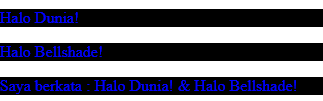

# DOM Nodelist

DOM Nodelist sendiri adalah kumpulan Node yang diekstrak melalui dokumen HTML. Jika kalian sudah pernah mempelajari `HTML Collection` sebelumnya, maka kalian mungkin bisa melihat perbedaan yang tidak terlalu jauh dengan Nodelist. Nodelist sendiri biasanya dihasilkan oleh `querySelectorAll()`.

## Nodelist Method

Nodelist memiliki beberapa method seperti :

- **Nodelist.item()**
  Digunakan untuk mengembalikan item dalam daftar menurut indeksnya.
- **Nodelist.entries()**
  Berguna untuk mengembalikan iterator untuk mendapatkan key atau value.
- **Nodelist.forEach()**
  Digunakan untuk mengambil semua elemen yang ada pada Nodelist.
- **Nodelist.keys()**
  Berguna untuk mengembalikan iterator keys dari key atau value berupa urutan index 0 dan seterusnya.
- **Nodelist.values()**
  Berguna untuk mengembalikan iterator values dari key atau value yang ada pada collection.

## Penggunaan Nodelist

**Studi kasus pertama**

HTML :

```html
<p>Halo Dunia!</p>
<p>Halo Bellshade!</p>
<p id="test"></p>
```

Javascript :

```javascript
const nodeList = document.querySelectorAll("p");
const test = document.getElementById("test");

test.innerHTML = `Saya berkata : ${nodeList[0].innerHTML} & ${nodeList[1].innerHTML}`;

// Membuat semua elemen paragraf <p> memiliki text berwarna biru
for (let i = 0; i < nodeList.length; i++) {
  nodeList[i].style.color = "blue";
}

// Membuat semua elemen paragraf <p> memiliki background hitam
nodeList.forEach((node) => (node.style.backgroundColor = "black"));
```

## Penjelasan

Diawal kita buat terlebih dahulu beberapa elemen paragraf yang akan kita manipulasi dengan DOM, lanjut ke Javascript kita mulai dengan menyeleksi elemen paragraf menggunakan `querySelectorAll()` dan kita juga mengambil elemen paragraf dengan id
`test` menggunakan `getElementById()`. Langkah selanjutnya kita akan gabungkan elemen yang ada pada `nodelist` menggunakan properti `innerHTML`, terlihat pada implementasi elemen nodelistnya kita menggunakan `[0]` dan `[1]` karena pada dasarnya elemen nodelist memiliki index yang sama seperti `Array`.

Kita juga menggunakan `for loop` untuk mengambil semua element yang ada pada `Nodelist` untuk memanipulasi elemen paragraf menjadi warna biru untuk teksnya dan penggunan `forEach` disini sama halnya dengan `for loop` yakni mengambil semua elemen `Nodelist` dan memanipulasi elemen paragraf dengan memberi background hitam.

**Hasil:**


**Studi kasus kedua**

HTML :

```html
<input type="checkbox" />
<input type="checkbox" />
<input type="checkbox" />
```

```javascript
const check = document.querySelectorAll("input[type=checkbox]");

for (checkbox of check) {
  checkbox.checked = true;
}
```

##Penjelasan

Pada studi kasus kedua ini kita ingin mengambil semua elemen input bertipe `checkbox`, tentu dengan menggunakan `Nodelist` akan menjadi lebih mudah karena kita bisa langsung mengambil semua inputnya. Pertama kita seleksi semua elemennya menggunakan `querySelectorAll()` sama seperti studi kasus pertama, setelahnya kita akan menggunakan `for of` untuk mengambil elemennya satu per satu untuk kita manipulasi checkboxnya agar terceklis untuk pertama kali.

**Hasil:**


**Referensi:** [HTML DOM Nodelist W3School](https://www.w3schools.com/js/js_htmldom_nodelist.asp)
**Referensi:** [HTML DOM Nodelist MDN](https://developer.mozilla.org/en-US/docs/Web/API/NodeList)

[](../008_Event_Bubbling_and_Capturing)
